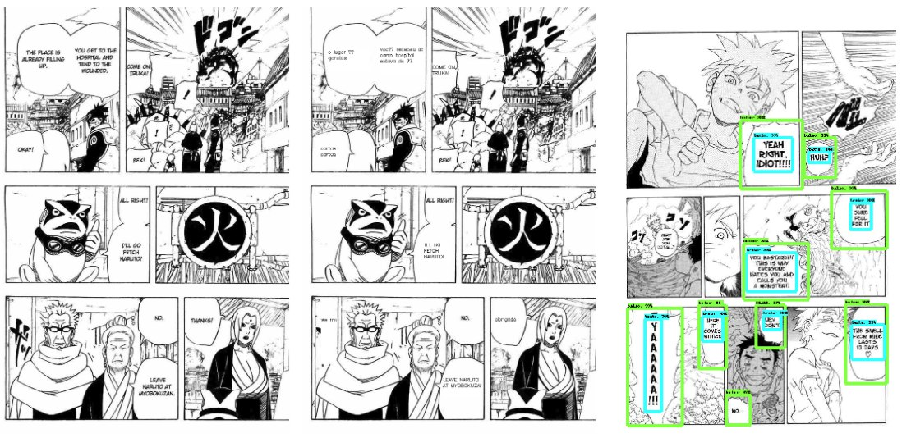

# Manga-Translator-With-Deep-Learning

>  Created by [Walter Betini](https://github.com/walterBSG) and [Victor Guedes](https://github.com/VictorGuedes)

This is a project in development for manga translation (Japanese comics) from English to Portuguese using Deep Learning concepts. For this, it was necessary to create an object detector, character extractor and the translator.

Follow the link of the codes used:

- [Tensorflow Object Detection API](https://github.com/tensorflow/models/tree/master/research/object_detection)
- [Tesseract OCR](https://github.com/tesseract-ocr/tesseract)
- [Python Tesseract](https://github.com/madmaze/pytesseract)



## TODOs

- [X] Object detector
- [X] Implement tesseract OCR in code
- [X] base translator
- [ ] handle names better
- [ ] Implementation in the code of a translator based on attention (https://colab.research.google.com/github/tensorflow/tensorflow/blob/master/tensorflow/contrib/eager/python/examples/nmt_with_attention/nmt_with_attention.ipynb)
- [ ] translate from japanese to English and other languages

## Requirements

Install Anaconda environment before throwing everything straight into your computer. Do not forget to install Tesseract OCR before installing Python Tesseract (They have better documentation on how to do this).

```
pip install tensorflow-gpu
pip install keras
pip install scipy
pip install matplotlib
pip install opencv-python
pip install pytesseract
```

## Datasets

The dataset of the manga we do not know if we can make it available, however it has been developed manually with the tool [LabelImg](https://github.com/tzutalin/labelImg). Below is the datasets used in the translator:

- [Tab-delimited Bilingual Sentence Pairs ](http://www.manythings.org/anki/)

## How to use

Put your images in the "test" folder and the result will appear in the "translated" folder. With the environment set up, run the following command.

```
python Manga-Translator.py
```

## License

Do whatever you want, enjoy. If you want to contribute to this project, do a pull request.
